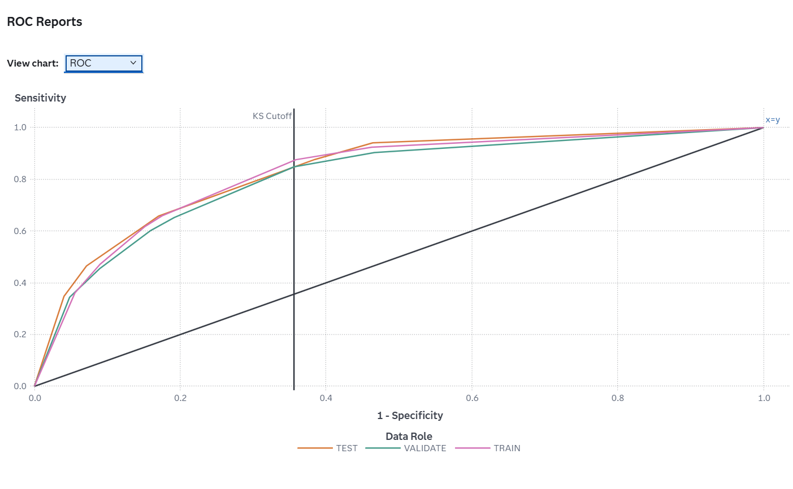
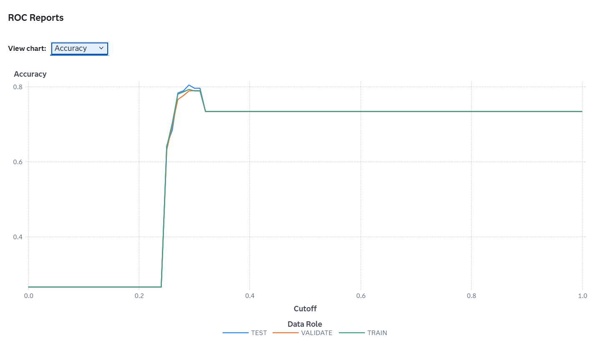
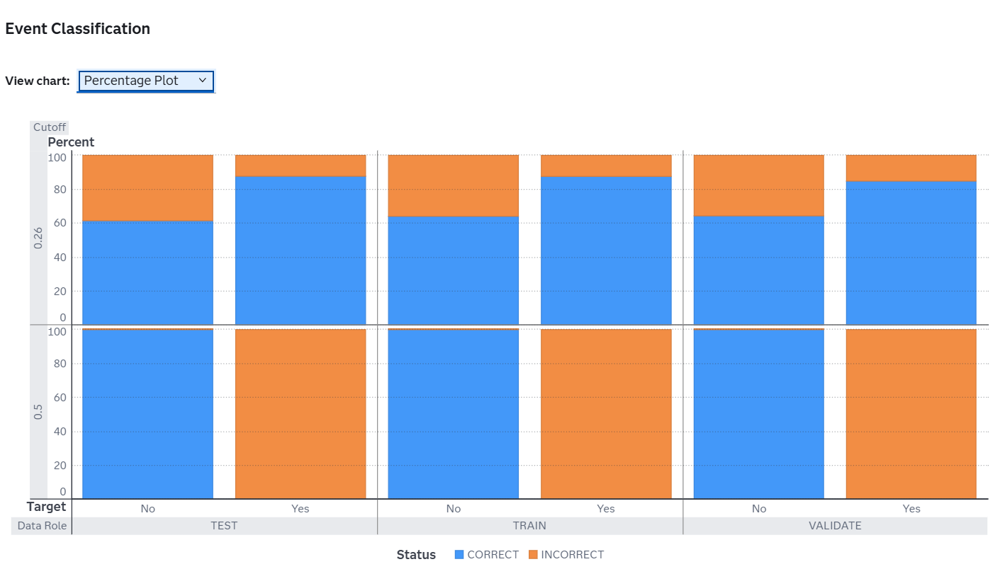

# Customer Churn Prediction (SAS Model Studio)

A machine learning project focused on predicting customer churn using SAS Model Studio, aiming to support data-driven business decision-making.

## 📌 Project Overview
This project aims to predict customer churn using machine learning models built in SAS Model Studio. The goal is to identify key factors influencing churn and support data-driven decision-making.

## 🛠️ Tools & Technologies
- SAS Studio
- SAS Model Studio
- Machine Learning (Logistic Regression, Decision Tree, Neural Network)

## ⚙️ Methodology
- Data cleaning and preprocessing
- Exploratory Data Analysis (EDA)
- Feature engineering
- Model building and evaluation (ROC, AUC)

## 📊 Results
- Developed and compared multiple models (Logistic Regression, Decision Tree, Neural Network)
- Achieved strong predictive performance using ROC-AUC evaluation
- Identified key churn drivers such as contract type and tenure

## 💡 Business Impact
The model enables organizations to identify high-risk customers and implement targeted retention strategies, improving customer loyalty and reducing revenue loss.
## 📸 Project Screenshots

### 🔹 Model Pipeline

### 🔹 ROC Curve

### 🔹 Accuracy Analysis

### 🔹 F1 Score

### 🔹 Classification Results

## 🔍 Model Interpretability

### 🔹 Partial Dependence Plot (PD)

This plot shows the overall effect of contract type on churn prediction.
- Month-to-month contracts have higher churn probability
- Long-term contracts reduce churn risk

---

### 🔹 PD & ICE Plot

This visualization combines global and individual-level effects:
- Confirms consistent churn patterns across customers
- Shows variation in individual predictions

---

### 🔹 LIME Explanation

This explains a single prediction:
- Contract type has the strongest influence
- Internet service and tenure also contribute
- Provides transparency into model decisions
